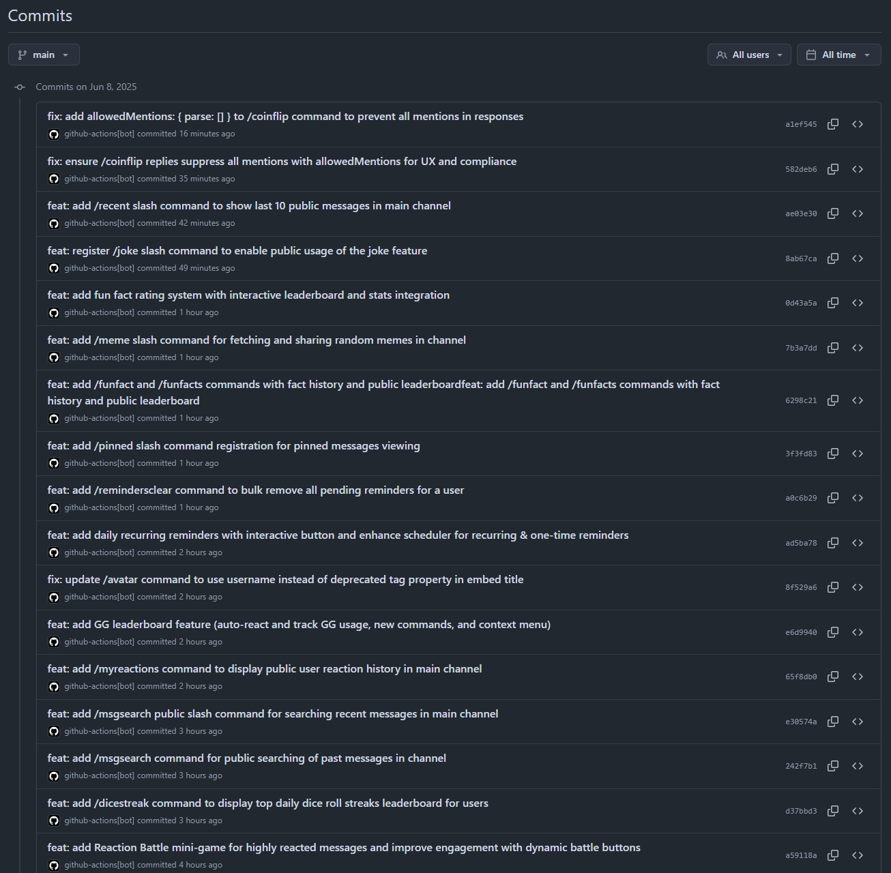
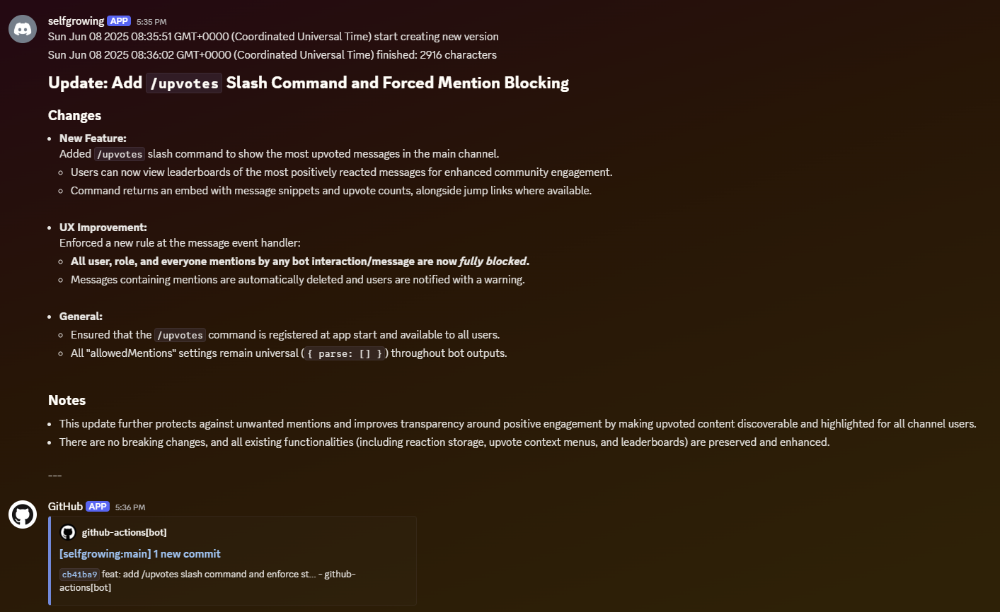

# 🪴 selfgrowing
An experimental Discord bot that evolves itself via ChatGPT–powered commits

`selfgrowing` is a proof-of-concept project in which ChatGPT reads, modifies and commits code directly to a GitHub repository, enabling a Discord.js bot to “self-grow” over time. Every change is visible as a commit in the repo, and the bot is automatically rebuilt and redeployed.

## What did you say??
Yes. you heard it right. [You can see the commit histories that made by ChatGPT](https://github.com/pmh-only/selfgrowing/commits/main/)

[](https://github.com/pmh-only/selfgrowing/commits/main/)

## How it works
1. **Scheduled Automation**\
A GitHub Actions workflow runs automation.mjs at regular intervals.
2. **Code Analysis & Suggestions**\
ChatGPT reads the current codebase and proposes code changes for enhancements or bug fixes.
1. **Review & Commit**\
ChatGPT reviews its own suggestions and commits them back to the repository.
1. **Build & Deploy**\
The updated code is built into a Docker image and deployed to your server.
1. **Running the Bot**\
After each commit, a new Docker image is published to GitHub Container Registry.
1. **Write a changelog**\
After the publish, ChatGPT writes Change log to my Discord server.


## I wanna try the result
To run the latest version:

```bash
docker run -it \
  -e DISCORD_TOKEN=<your_discord_token> \
  -e DISCORD_GUILD_ID=<your_guild_id> \
  -e DISCORD_CHANNEL_ID=<your_channel_id> \
  ghcr.io/pmh-only/selfgrowing:latest
```

Note: This bot currently supports only a single guild (server) and channel. Set the `DISCORD_GUILD_ID` and `DISCORD_CHANNEL_ID` environment variables accordingly.

### Environment variables
| Variable | Description |
|:---------|:------------|
| `DISCORD_TOKEN` |	Your Discord bot token |
| `DISCORD_GUILD_ID` | ID of the server where the bot will operate |
| `DISCORD_CHANNEL_ID` | ID of the channel where the bot will operate |

### Persistent datas
this image stores persistent data on /data/ folder. you need to mount the volume if you wanna keep the data.

```bash
docker run -itv ./selfgrowing:/data/ \
  -e DISCORD_TOKEN=<your_discord_token> \
  -e DISCORD_GUILD_ID=<your_guild_id> \
  -e DISCORD_CHANNEL_ID=<your_channel_id> \
  ghcr.io/pmh-only/selfgrowing:latest
```

## Supported features (at 25/06/08 06:00 KST)
*(All commands run in the **single configured text channel** unless otherwise noted.)*

### 1. Productivity & Personal Tools
| Command / Action | What it does |
| --- | --- |
| `/todo add | list | complete | remove | edit` | Public, collaborative to-do list (pin-note migration, completion tracking, fuzzy-match suggestions). |
| `/note add | list | delete | search` | Simple public notes (10 most recent, search, delete). |
| `/remind` | One-off reminder (public ping). |
| **Recurring reminders** | “Make this daily” button converts a one-off into a daily rule. |
| `/reminders`, `/reminderremove`, `/remindersclear`, `/reminderslog` | View, delete single, clear all, browse sent-history. |
| `/timer` / `/timers` | Countdown timers with list & auto-ping. |
| Pinned messages (`/pin`, `/pinned`) | Save arbitrary messages with optional note; list last 10. |
| Sticky message (`/sticky`) | Channel-top “sticky” that re-posts every few minutes. |

### 2. Polls & Surveys
| Feature | Details |
| --- | --- |
| `/poll` | 2-5 options, A–E emoji, ≤ 24 h, live tally, “Retract Vote”, auto-close + winners. |
| `/pollresults` | View current results. |
| Auto-cleanup | Expired polls closed on startup. |

### 3. Moderation & Admin Utilities
| Command / CM-Menu | Purpose |
| --- | --- |
| `/warn`, `/warnings`, `/clearwarnings` | Issue & track warnings; view / mass-clear. |
| Delete-warning buttons | One-click removal of individual warnings. |
| `/report`, `/reports` | Public report log with delete buttons. |
| **Bad-words filter** | Code list + live editable JSON block-list. |
| `/purge` | Bulk delete (≤ 50), 60 s cooldown, confirm button. |
| `Mute XP` (user CM) | Toggle XP-gain for a user. |
| `/settings autodelete / badword` | Channel bot-reply deletion & add bad words. |
| `/dmuser` | Admin broadcast to a user (re-sent publicly). |
| `/snipe` | Show last deleted message (with link). |

### 4. XP, Levels & Stats
| Command | Shows |
| --- | --- |
| `/xp` | Current XP/level + inferred level-up history. |
| `/leaderboard` | Top-10 XP and top chatters. |
| “XP Leaderboard” button | Instant rank list. |
| `/stats` | Global counters (messages, notes, warnings, best fun-fact, …). |
| `/settings_user mute_xp` | Self-mute / un-mute XP gain. |

### 5. Reactions, Voting & Feedback
| Feature | Details |
| --- | --- |
| CM “Thumbs Up / Down” | Stores to DB, auto-reacts, vote leaderboards. |
| **Reaction Battle** | Starts when 👍 + 👎 ≥ 10 on a message. |
| `/upvotes`, `/downvotes` | Channel’s most-voted messages embeds. |
| **Feedback board** (`/feedback`, `/feedbacklist`) | Post idea, community 👍/👎, status & category tags (`/suggesthandle`). |
| Suggestions (`/suggest`, `/suggestions`) | Similar board with voting & admin handling. |

### 6. Fun & Games
| Command / Button | Game |
| --- | --- |
| `/roll` | Arbitrary dice formulas; quick-roll buttons. |
| `/rollhist`, `/rollstats`, `roll_leaderboard` | Personal history & global stats. |
| **Dice War** (`/dicewar`) | 1 d20 duel, accept/decline buttons, leaderboard. |
| **Highest-Roll Party** | Join/Start/Cancel multi-player d20. |
| `/dicewarleaderboard`, `/dicestreak` | Wins & daily streak rankings. |
| `/rockpaperscissors` | Bot or PvP buttons; `/rps-stats` leaderboard. |
| `/coinflip`, `/8ball` | Quick fun. |
| `/funfact` + rating buttons | Random fact with 1–5 star ratings; `/funfacts` leaderboard. |
| `/joke`, `/meme` | Random joke & meme. |
| `/daily`, `/dailyleaderboard` | Daily reward streak system. |
| **GG counter** | Auto-detect “gg”; `/gg`, `/ggleaderboard`. |

### 7. Slash-Command Utilities
`/avatar`, `/userinfo`, `/calc`, `/msgsearch`, `/recent`, `/quote / quoteadd / quotes`, `/announce`, `/dicewarleaderboard`, …  

*(Full list auto-registered at startup.)*

### 8. Data & Persistence
*SQLite tables:* `notes`, `todo_entries`, `poll`, `reactions`, `suggestion`, `feedback`, `reminders`, `reminders_log`, `xp`, `warnings`, `message_logs`, `timers`, `pinned_messages`, `sticky`, `user_settings`, `user_tags`.  
*JSON in `/data`:* fun-facts ratings, dice history, reports, recurring reminders, announcements, dice-war leaderboard, blocked-words, etc.

### 9. Quality-of-Life Extras
* Welcome embed with **“Get Started”** button.  
* Automatic poll-expiry check on startup.  
* Sticky message throttling & auto-delete.  
* DB schema auto-migrations.  
* Global error handlers.  
* No user/role pings (`allowedMentions: parse: []`) everywhere.

and keep evolving...!

## Copyright notices
&copy; 2025. Minhyeok Park (@pmh-only) <pmh_only@pmh.codes>

I only reserves copyrights for automation code and prompts. [See the MIT License for that.](./LICENSE)\
All codes in `/workspace` are automatically generated by ChatGPT. so it is a public domain. you can use what ever you want.
